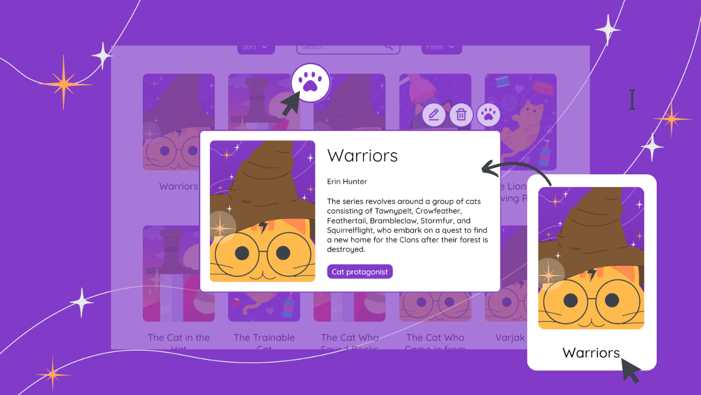

<h1 align="center">Cat's library</h1>

<div align="center">
   The perfect place for lovers of books and cats
</div>

## Table of contents
- [Getting Started](#getting-started)
  - [Built with](#built-with)
  - [Installation](#installation)
- [Overview](#overview)
  - [Screenshot](#screenshot)
  - [Links](#links)
- [How to use](#how-to-use)
  - [Books](#books)
  - [Book](#book)
  - [Create book](#create-book)
  - [Edit book](#edit-book)
  - [Delete book](#delete-book)
- [Contact](#contact)

## Getting Started
### Built with


- JavaScript
- React
- CSS

### Installation
Run the following commands:
```
npm install
```
Running the app
```
npm run dev
```
To view it open http://localhost:5173

## Overview
### Screenshot


### Links
- Live Site URL: [Cat's library](https://cat-s-library.vercel.app)
- Code in Github: [https://github.com/FatimaGR/Cat-s-library](https://github.com/FatimaGR/Cat-s-library)

## How to use
### Books
You will find different books here, sort and filter them. You can also search them by name and change pages to find more books.


### Book
To read more about a book, you can click on the book name. A modal will appear; if you want to close it after finishing reading, click the paw button.



### Create book
If you have a book to recommend, you can go to the "Create" page by clicking the "Create" option in the navbar or on the books page. 

Here, you can complete the information. You will also find a guide about theme options.


### Edit book
If you need to change the information of a book, click the pencil button and the modal information will change. You can go to the "Edit" page by clicking the "Yes, edit" button. 

Here, you can update the book information.


### Delete book
To delete a book, click the trash button and the modal information will change. Read the message and if you are sure, click the "Yes, delete" button. 

If you decide not to delete the book, click the "No, cancel" button, and you will return to the book information.


## Contact
- Website - [Fatima Gallardo](https://porfolio-website-gules.vercel.app)
- GitHub - [@FatimaGR](https://github.com/FatimaGR)